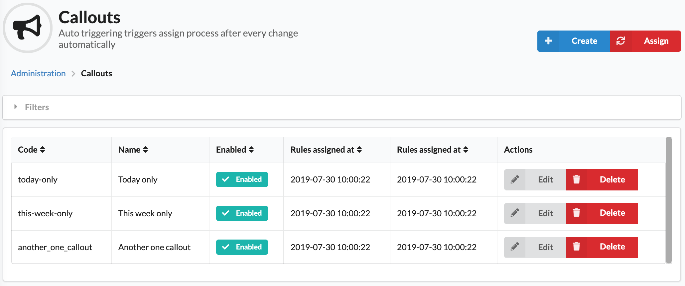

# Sylius Callout Plugin

[![Latest Version][ico-version]][link-packagist]
[![Latest Unstable Version][ico-unstable-version]][link-packagist]
[![Software License][ico-license]](LICENSE)
[![Build Status][ico-github-actions]][link-github-actions]
[![Quality Score][ico-code-quality]][link-code-quality]

The callout plugin for [Sylius](https://sylius.com/) allows you to configure nice badges for different set of products
based on specific rules. It provides a common set of configuration by default and is very flexible when it comes to adding new ones.

Supports Doctrine ORM driver only.

## Screenshots

Shop:


Admin:



## Installation

### Step 1: Install dependencies

This plugin depends upon the [Doctrine ORM Batcher bundle](https://github.com/Setono/DoctrineORMBatcherBundle). Install that bundle first.

### Step 2: Download the plugin

Open a command console, enter your project directory and execute the following command to download the latest stable version of this plugin:

```bash
$ composer require setono/sylius-callout-plugin
```

This command requires you to have Composer installed globally, as explained in the [installation chapter](https://getcomposer.org/doc/00-intro.md) of the Composer documentation.

### Step 3: Enable the plugin

Then, enable the plugin by adding it to the list of registered plugins/bundles
in `config/bundles.php` file of your project *before* (!) `SyliusGridBundle`:

```php
<?php
$bundles = [
    Setono\DoctrineORMBatcherBundle\SetonoDoctrineORMBatcherBundle::class => ['all' => true],
    Setono\SyliusCalloutPlugin\SetonoSyliusCalloutPlugin::class => ['all' => true],
    Sylius\Bundle\GridBundle\SyliusGridBundle::class => ['all' => true],
];
```

Don't forget to add `SetonoDoctrineORMBatcherBundle` as this plugin require bundle to be enabled.

### Step 4: Configure plugin
```yaml
# config/packages/setono_product_callout.yaml

imports:
    - { resource: "@SetonoSyliusCalloutPlugin/Resources/config/app/config.yaml" }
    
# If you want to see Callout column at admin products list - uncomment next line
#    - { resource: "@SetonoSyliusCalloutPlugin/Resources/config/grids/sylius_admin_product.yaml" }

setono_sylius_callout:
    manual_triggering: false
    # Enable manual triggering if your store have too much products
    # That way you can trigger callouts assign process manually when
    # finish adding all rules
    # manual_triggering: true
    
    no_rules_eligible: false
    # Set this option to true if you want no rules to be
    # treated as eligible (e.g. callout without rules will 
    # be applied to all products)
    # no_rules_eligible: true
```

### Step 5: Import routing

```yaml
# config/routes/setono_product_callout.yaml

setono_product_callout:
    resource: "@SetonoSyliusCalloutPlugin/Resources/config/routing.yaml"
```

### Step 6: Customize models

Read more about Sylius models customization [here](https://docs.sylius.com/en/latest/customization/model.html).

#### Customize your Product model

Add a `Setono\SyliusCalloutPlugin\Model\CalloutsAwareTrait` trait to your `App\Entity\Product` class.

- If you use `annotations` mapping:

    ```php
    <?php 
    // src/Entity/Product.php
    
    namespace App\Entity;

    use Setono\SyliusCalloutPlugin\Model\CalloutsAwareTrait as SetonoSyliusCalloutCalloutsAwareTrait;
    use Setono\SyliusCalloutPlugin\Model\ProductInterface as SetonoSyliusCalloutProductInterface;
    use Sylius\Component\Core\Model\Product as BaseProduct;
    use Doctrine\ORM\Mapping as ORM;
    
    /**
     * @ORM\Entity
     * @ORM\Table(name="sylius_product")
     */
    class Product extends BaseProduct implements SetonoSyliusCalloutProductInterface
    {
        use SetonoSyliusCalloutCalloutsAwareTrait {
            SetonoSyliusCalloutCalloutsAwareTrait::__construct as private __calloutsTraitConstruct;
        }
      
        public function __construct()
        {
            $this->__calloutsTraitConstruct();
            parent::__construct();
        }
    }
    ```
    
- If you use `xml` mapping:

    ```php
    <?php
    // src/Model/Product.php
    
    namespace App\Model;
    
    use Setono\SyliusCalloutPlugin\Model\CalloutsAwareTrait as SetonoSyliusCalloutCalloutsAwareTrait;
    use Setono\SyliusCalloutPlugin\Model\ProductInterface as SetonoSyliusCalloutProductInterface;
    use Sylius\Component\Core\Model\Product as BaseProduct;
    
    class Product extends BaseProduct implements SetonoSyliusCalloutProductInterface
    {
        use SetonoSyliusCalloutCalloutsAwareTrait {
            SetonoSyliusCalloutCalloutsAwareTrait::__construct as private __calloutsTraitConstruct;
        }
      
        public function __construct()
        {
            $this->__calloutsTraitConstruct();
            parent::__construct();
        }
    }
    ```

    ```xml
    <?xml version="1.0" encoding="UTF-8"?>
    
    <doctrine-mapping xmlns="http://doctrine-project.org/schemas/orm/doctrine-mapping"
                      xmlns:xsi="http://www.w3.org/2001/XMLSchema-instance"
                      xsi:schemaLocation="http://doctrine-project.org/schemas/orm/doctrine-mapping
                                          http://doctrine-project.org/schemas/orm/doctrine-mapping.xsd">
    
        <entity name="App\Model\Product" table="sylius_product">
            <many-to-many field="callouts" target-entity="Setono\SyliusCalloutPlugin\Model\CalloutInterface">
                <join-table name="setono_sylius_callout__product_callouts">
                    <join-columns>
                        <join-column name="product_id" referenced-column-name="id" nullable="false" on-delete="CASCADE" />
                    </join-columns>
                    <inverse-join-columns>
                        <join-column name="callout_id" referenced-column-name="id" nullable="false" on-delete="CASCADE" />
                    </inverse-join-columns>
                </join-table>
            </many-to-many>
        </entity>
    
    </doctrine-mapping>
    ```

If you haven't done so already, configure the `sylius_product` resource to point to your `App\Entity\Product` like we 
did in an example [here](tests/Application/config/packages/_sylius.yaml).

### Step 7: Update your database schema

```bash
$ php bin/console doctrine:migrations:diff
$ php bin/console doctrine:migrations:migrate
```
 
### Step 8: Add callouts to your product templates 
Add callouts to your product box template. By default, you should use `templates/bundles/SyliusShopBundle/Product/_box.html.twig` 
path. Check out our [_box.html.twig](tests/Application/templates/bundles/SyliusShopBundle/Product/_box.html.twig) file for a reference.

Note the line: ``.

### Step 9: Using asynchronous transport (optional, but recommended)

All commands in this plugin will extend the [CommandInterface](src/Message/Command/CommandInterface.php).
Therefore you can route all commands easily by adding this to your [Messenger config](https://symfony.com/doc/current/messenger.html#routing-messages-to-a-transport):

```yaml
# config/packages/messenger.yaml
framework:
    messenger:
        routing:
            # Route all command messages to the async transport
            # This presumes that you have already set up an 'async' transport
            'Setono\SyliusCalloutPlugin\Message\Command\CommandInterface': async
```

### Step 10: Configure cron job
For the performance reasons, configure a cron job on your production server to execute `$ bin/console setono:sylius-callout:assign` command 
once in a while in order to rebuild the index for callouts. In most cases it should be done by the resource event listener
triggered anytime you create/update a product or callout, but it is worth to have it covered if something goes wrong.

Example cron configuration (`EDITOR=nano sudo crontab -e`) to run command once a day:

```
0 2 * * * www-data /var/www/html/bin/console setono:sylius-callout:assign --env=prod
```

### Step 11: Install assets
```bash
$ bin/console assets:install
```

## Usage

From now on you should be able to add new callouts in the admin panel. Once you add one, you just need to configure.

## Customization

Adding a new rule form
----------------------

1. Configure a new form under `App\Form\Type\Rule` namespace,
2. Add a rule checker under `App\Checker\Rule` namespace and
make sure it implements `Setono\SyliusCalloutPlugin\Callout\Checker\Rule\ProductCalloutRuleCheckerInterface` interface and has a `public const TYPE` 
set corresponding to the below service configuration 
3. Register and tag new services:
```xml
<!-- services.xml -->
<services>
    ...
    
    <service id="app.callout_rule_checker.is_on_sale" class="Setono\SyliusCalloutPlugin\Callout\Checker\Rule\IsOnSaleRuleChecker">
        <argument type="service" id="setono_sylius_callout.checker.product_promotion" />
        <tag name="setono_sylius_callout.callout_rule_checker" type="is_on_sale" label="setono_sylius_callout.ui.is_on_sale" form-type="Setono\SyliusCalloutPlugin\Form\Type\Rule\IsOnSaleConfigurationType" />
    </service>
    
    <service id="app.form.type.rule.is_on_sale" class="Setono\SyliusCalloutPlugin\Form\Type\Rule\IsOnSaleConfigurationType">
        <tag name="form.type" />
    </service>
</services>
```

## Troubleshooting

- `The service "setono_sylius_callout.command_bus.middleware.handle_message" has a dependency on a non-existent service "setono_doctrine_orm_batcher.factory.batcher".`

  You forgot to add `SetonoDoctrineORMBatcherBundle` to your app's `bundles.php`

[ico-version]: https://poser.pugx.org/setono/sylius-callout-plugin/v/stable
[ico-unstable-version]: https://poser.pugx.org/setono/sylius-callout-plugin/v/unstable
[ico-license]: https://poser.pugx.org/setono/sylius-callout-plugin/license
[ico-github-actions]: https://github.com/Setono/SyliusCalloutPlugin/workflows/build/badge.svg
[ico-code-quality]: https://img.shields.io/scrutinizer/g/Setono/SyliusCalloutPlugin.svg

[link-packagist]: https://packagist.org/packages/setono/sylius-callout-plugin
[link-github-actions]: https://github.com/Setono/SyliusCalloutPlugin/actions
[link-code-quality]: https://scrutinizer-ci.com/g/Setono/SyliusCalloutPlugin
