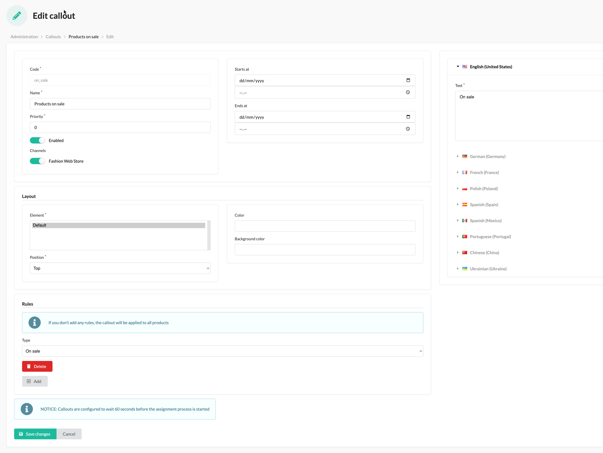

# Sylius Callout Plugin

[![Latest Version][ico-version]][link-packagist]
[![Software License][ico-license]](LICENSE)
[![Build Status][ico-github-actions]][link-github-actions]
[![Code Coverage][ico-code-coverage]][link-code-coverage]

The callout plugin for [Sylius](https://sylius.com/) allows you to configure nice callouts/badges for sets of products
based on specific rules. It provides a common set of rules by default and is very flexible when it comes to adding new ones.

- [Go to installation instructions](#installation)

## Screenshots

### Shop


### Admin




## Installation

### Step 1: Download the plugin

```bash
$ composer require setono/sylius-callout-plugin
```

### Step 2: Enable the plugin

Then, enable the plugin by adding it to the list of registered plugins/bundles
in `config/bundles.php` file of your project *before* (!) `SyliusGridBundle`:

```php
<?php
$bundles = [
    Setono\SyliusCalloutPlugin\SetonoSyliusCalloutPlugin::class => ['all' => true],
    Sylius\Bundle\GridBundle\SyliusGridBundle::class => ['all' => true],
];
```

### Step 3: Configure plugin
```yaml
# config/packages/setono_sylius_callout.yaml

imports:
    - { resource: "@SetonoSyliusCalloutPlugin/Resources/config/app/config.yaml" }
```

### Step 4: Import routing

```yaml
# config/routes/setono_sylius_callout.yaml

setono_sylius_callout:
    resource: "@SetonoSyliusCalloutPlugin/Resources/config/routes.yaml"
```

### Step 5: Extend entities

#### Extend `Product`

Add the `Setono\SyliusCalloutPlugin\Model\ProductTrait` trait to your `App\Entity\Product\Product` class.

```php
<?php 
// src/Entity/Product/Product.php

namespace App\Entity;

use Setono\SyliusCalloutPlugin\Model\ProductTrait as CalloutProductTrait;
use Setono\SyliusCalloutPlugin\Model\ProductInterface as CalloutProductInterface;
use Sylius\Component\Core\Model\Product as BaseProduct;
use Doctrine\ORM\Mapping as ORM;

/**
 * @ORM\Entity
 * @ORM\Table(name="sylius_product")
 */
class Product extends BaseProduct implements CalloutProductInterface
{
    use CalloutProductTrait {
        __construct as private initializeCalloutProductTrait;
    }
  
    public function __construct()
    {
        parent::__construct();
        
        $this->initializeCalloutProductTrait();
    }
}
```

### Step 6: Update your database schema

```bash
$ php bin/console doctrine:migrations:diff
$ php bin/console doctrine:migrations:migrate
```
 
### Step 7: Add callouts to your product templates 
Add callouts to your product box template. By default, you should use `templates/bundles/SyliusShopBundle/Product/_box.html.twig` 
path. Check out our [_box.html.twig](tests/Application/templates/bundles/SyliusShopBundle/Product/_box.html.twig) file for a reference.

Note the line: ``.

### Step 8: Using asynchronous transport (optional, but recommended)

All commands in this plugin will extend the [CommandInterface](src/Message/Command/CommandInterface.php).
Therefore, you can route all commands easily by adding this to your [Messenger config](https://symfony.com/doc/current/messenger.html#routing-messages-to-a-transport):

```yaml
# config/packages/messenger.yaml
framework:
    messenger:
        routing:
            # Route all command messages to the async transport
            # This presumes that you have already set up an 'async' transport
            'Setono\SyliusCalloutPlugin\Message\Command\CommandInterface': async
```

### Step 9: Configure cron job
For the performance reasons, configure a cron job on your production server to execute `$ bin/console setono:sylius-callout:assign` command 
once in a while in order to rebuild the index for callouts. In most cases it should be done by the resource event listener
triggered anytime you create/update a product or callout, but it is worth to have it covered if something goes wrong.

Example cron configuration (`EDITOR=nano sudo crontab -e`) to run command once a day:

```
0 2 * * * www-data /var/www/html/bin/console setono:sylius-callout:assign --env=prod
```

### Step 10: Install assets
```bash
$ bin/console assets:install
```

## Usage

From now on you should be able to add new callouts in the admin panel. Once you add one, you just need to configure.

## Customization

Adding a new rule form
----------------------

1. Configure a new form under `App\Form\Type\Rule` namespace,
2. Add a rule checker under `App\Checker\Rule` namespace and
make sure it implements `Setono\SyliusCalloutPlugin\Checker\Rule\ProductCalloutRuleCheckerInterface` interface and has a `public const TYPE` 
set corresponding to the below service configuration 
3. Register and tag new services:
```xml
<!-- services.xml -->
<services>
    ...
    
    <service id="app.callout_rule_checker.is_on_sale" class="Setono\SyliusCalloutPlugin\Callout\Checker\Rule\IsOnSaleRuleChecker">
        <argument type="service" id="setono_sylius_callout.checker.product_promotion" />
        <tag name="setono_sylius_callout.callout_rule_checker" type="is_on_sale" label="setono_sylius_callout.ui.is_on_sale" form-type="Setono\SyliusCalloutPlugin\Form\Type\Rule\IsOnSaleConfigurationType" />
    </service>
    
    <service id="app.form.type.rule.is_on_sale" class="Setono\SyliusCalloutPlugin\Form\Type\Rule\IsOnSaleConfigurationType">
        <tag name="form.type" />
    </service>
</services>
```

## Troubleshooting

- `The service "setono_sylius_callout.command_bus.middleware.handle_message" has a dependency on a non-existent service "setono_doctrine_orm_batcher.factory.batcher".`

  You forgot to add `SetonoDoctrineORMBatcherBundle` to your app's `bundles.php`

[ico-version]: https://poser.pugx.org/setono/sylius-callout-plugin/v/stable
[ico-license]: https://poser.pugx.org/setono/sylius-callout-plugin/license
[ico-github-actions]: https://github.com/Setono/SyliusCalloutPlugin/workflows/build/badge.svg
[ico-code-coverage]: https://codecov.io/gh/Setono/SyliusCalloutPlugin/graph/badge.svg

[link-packagist]: https://packagist.org/packages/setono/sylius-callout-plugin
[link-github-actions]: https://github.com/Setono/SyliusCalloutPlugin/actions
[link-code-coverage]: https://codecov.io/gh/Setono/SyliusCalloutPlugin
